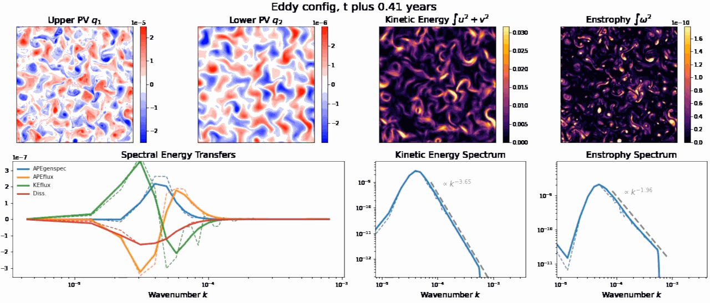

# PYQG Subgrid Forcing Experiments



## Summary

This repository contains code that uses [`pyqg`](https://pyqg.readthedocs.io/en/latest/) (a quasi-geostrophic ocean simulation library) to test out machine learning parameterizations as well as generate datasets for training them. It also contains associated code for training such ML parameterizations and evaluating their offline and online performance.

## Usage

**NOTE: this is still in draft form, and subject to change.**

### Installation

1. Clone this repository
1. Clone the repository for [this development version of pyqg](https://github.com/asross/pyqg)
1. Run `pip install --editable .` in both directories

Note: cloning the development version of pyqg will hopefully not be necessary
once our parameterization framework is merged.

### Generating/loading datasets for learning subgrid forcing parameterizations

The following code will generate an xarray dataset of snapshots from two-layer [`pyqg.QGModel`](https://pyqg.readthedocs.io/en/latest/equations/notation_twolayer_model.html) simulations at two different resolutions (from random initial conditions, with snapshots saved every 1000 timesteps by default):

```python
from pyqg_subgrid_experiments.generate_dataset import generate_forcing_dataset

pyqg_qgmodel_params = dict(beta=1.5e-11, delta=0.1)

# Run two simulations in parallel (one with nx1 grid cells and another with
# nx2 < nx1 grid cells, but otherwise the same parameters), where the lower
# resolution simulation is updated every timestep to have the initial
# conditions of the high-resolution model, but coarse-grained
dataset = generate_forcing_dataset(hires=256, lores=64, **pyqg_qgmodel_params)

# This dataset will contain snapshots of these coarse-grained hi-res variables
# every 1000 timesteps (interval can be configured with `sampling_freq`), as
# well as subgrid forcing terms which can be used to train parameterizations
print(dataset.q.shape) # (2,64,64)
print(dataset.ufull.shape) # (2,64,64)
print(dataset.vfull.shape) # (2,64,64)
print(dataset.u_forcing_advection.shape) # (2,64,64)
print(dataset.v_forcing_advection.shape) # (2,64,64)
print(dataset.q_forcing_advection.shape) # (2,64,64)
print(dataset.q_forcing_empirical.shape) # (2,64,64)

# The dataset is an xarray dataset and can be saved as a netcdf file 
dataset.to_netcdf('hires_downscaled.nc')

# You can also create subgrid forcing datasets with custom spatial filters
import gcm_filters
filter = gcm_filters.Filter(filter_scale=8, dx_min=2, grid_type=gcm_filters.GridType.REGULAR)
dataset2 = generate_forcing_dataset(hires=256, lores=64, filter=filter, **pyqg_qgmodel_params)
```

This dataset can be used to define a variety of prediction tasks, e.g. predicting subgrid velocity forcings from coarse-grained velocities. We discuss the different variables saved [below](#subgrid-dataset-variables).

Simulations can also be run and saved via the command line:

```bash
python pyqg_subgrid_experiments/generate_dataset.py \
    --hires=256 --lores=64 --beta=1.5e-11 --delta=0.1 \
    --save_to=hires_downscaled.nc 
```

If you're on the NYU HPC cluster, you can run simulations in parallel via SLURM
to create a larger dataset:

```bash
SINGULARITY_ENV=/scratch/asr9645/envs/m2lines.ext3:ro python pyqg_subgrid_experiments/generate_dataset.py \
    --hires=256 --lores=64 --beta=1.5e-11 --delta=0.1 \
    --n_simulations=250 --save_dir=datasets/train

SINGULARITY_ENV=/scratch/asr9645/envs/m2lines.ext3:ro python pyqg_subgrid_experiments/generate_dataset.py \
    --hires=256 --lores=64 --beta=1.5e-11 --delta=0.1 \
    --n_simulations=25 --save_dir=datasets/test
```

This will save each simulation as a separate numbered netcdf file within the
given `save_dir`. However, if you're on the NYU cluster, then you can also load
pregenerated datasets [discussed below](#pregenerated-datasets).

If you're not on the NYU HPC cluster, then you'll need to write your own
platform-specific code to do this, or obtain the data via other means **(we hope
to host this data on AWS or Pangeo soon)**.

### Running (un)parameterized simulations

Assuming you have [this development version of pyqg](https://github.com/asross/pyqg) loaded, you can define parameterizations either with respect to velocities or with respect to potential vorticity, and run simulations with (or without) them:

```python
from pyqg_subgrid_experiments.generate_dataset import generate_dataset

def uv_forcing_parameterization(model):
    return np.zeros_like(model.u), np.zeros_like(model.v)

def q_forcing_parameterization(model):
    return np.zeros_like(model.q)

sim_params = dict(nx=64, beta=1.5e-11, delta=0.1)

parameterized_dataset1 = generate_dataset(uv_parameterization=uv_forcing_parameterization, **sim_params)
parameterized_dataset2 = generate_dataset(q_parameterization=q_forcing_parameterization, **sim_params)
baseline_dataset = generate_dataset(**sim_params)
```

### Comparing simulations

Ideally, parameterized low-resolution simulations should be statistically similar to downscaled high-resolution simulations (or at least more statistically similar than unparameterized low-resolution simulations). We provide a number of metrics for quantifying this kind of similarity:

```python
import xarray as xr
from pyqg_subgrid_experiments.metrics import compare_simulations
from pyqg_subgrid_experiments.plot_helpers import visualize_simulations

hires = xr.load_mfdataset("datasets/config1/hires_downscaled/*.nc", concat_dim="run", combine="nested")
lores = xr.load_mfdataset("datasets/config1/lores/*.nc", concat_dim="run", combine="nested")
param = xr.load_mfdataset("datasets/config1/lores_parameterized/*.nc", concat_dim="run", combine="nested")

# Quantitatively compare simulations using various distributional / spectral distance metrics
hires_vs_param = compare_simulations(hires, param)
hires_vs_lores = compare_simulations(hires, lores)

# Visually compare simulations using matplotlib
visualize_simulations(
    hires.assign_attrs(plot_kwargs=dict(color='black', label='Hi-res (downscaled)')),
    lores.assign_attrs(plot_kwargs=dict(color='gray',  label='Lo-res')),
    param.assign_attrs(plot_kwargs=dict(color='green', label='Lo-res (parameterized')),
)
```

## Subgrid dataset variables

In addition to the [variables saved by pyqg](https://github.com/asross/pyqg/blob/master/pyqg/xarray_output.py), we save the following in our subgrid forcing datasets:

### `u_forcing_advection` and `v_forcing_advection`


These are the traditional

### `q_forcing_advection`

TODO

### `uq_difference` and `vq_difference`

TODO

### `q_forcing_empirical`

TODO

### Various versions of `dqdt`

TODO


## Pregenerated datasets

TODO
